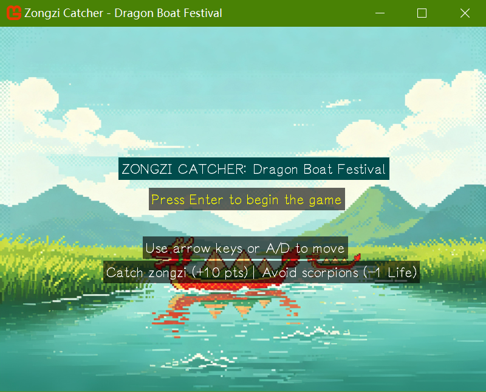

# Zongzi Catcher (F#, MonoGame) 🛶🍙

A fun and festive Dragon Boat Festival-themed game built with F# and MonoGame!

> 🎉 **Belated Dragon Boat Festival Gift!** The festival was yesterday (June 19th 2026), but the celebration continues with this zongzi-catching adventure! 🎉



## 🎮 Game Overview

Zongzi Catcher is a classic "catch the falling items" arcade game with a Chinese cultural twist. Guide your dragon boat to catch as many delicious zongzi (rice dumplings) as possible while avoiding the pesky scorpions that fall from above!

### Game Features
- **Traditional Dragon Boat Festival Theme** - Celebrate the holiday with zongzi and dragon boat imagery
- **Simple Controls** - Easy to learn, hard to master
- **Score System** - Earn points for catching zongzi, lose points for missing them
- **Life System** - 3 lives to survive the scorpion attacks
- **Retro Sound Effects** - Enjoy 8-bit style audio feedback
- **Chiptune BGM** - Immersive background music

## 🕹️ How to Play

### Controls
| Action | Key |
|--------|-----|
| Move Left | ← (Left Arrow) or A |
| Move Right | → (Right Arrow) or D |
| Start/Restart | Enter |

### Game Rules
- **Catch Zongzi** (+10 points) - Grab these traditional rice dumplings to boost your score
- **Avoid Scorpions** (-1 Life) - These creepy crawlies will cost you a life if you touch them
- **Don't Miss Zongzi** (-5 points) - Letting zongzi fall into the water deducts points
- **Survive** - See how high you can score before losing all 3 lives!

## 🛠️ Technical Details

### Built With
- **F#** - Functional programming language
- **MonoGame** - Cross-platform game framework
- **Elmish** - Functional architecture for games
- **Mibo** - F# game utilities library

### Project Structure
```
ZongziCatcher.FSharpGame/
├── Content/           # Game assets (images, sounds, fonts)
├── Actor.fs           # Game actor definitions
├── Essentials.fs      # Constants, events, and sound management
├── Program.fs         # Main game logic and rendering
└── ZongziCatcher.FSharpGame.fsproj
```

## 📦 Installation & Running

### Prerequisites
- [.NET 10.0](https://dotnet.microsoft.com/download/dotnet/10.0) or later
- MonoGame SDK (for development)

### Cloning the Repository

```bash
git clone https://github.com/Pac-Dessert1436/ZongziCatcher.FSharpGame.git
```

### Running the Game

**From Source:**
```bash
cd ZongziCatcher.FSharpGame
dotnet run
```

## 🎨 Asset Credits

### Fonts
| Asset | Author | Source | License |
|-------|--------|--------|---------|
| Yozai Regular | lxgw | [GitHub](https://github.com/lxgw/yozai-font) | OFL-1.1 |

### Sound Effects
| Asset | Author | Source | License |
|-------|--------|--------|---------|
| 8-bit Sound Pack | SubspaceAudio | [OpenGameArt](https://opengameart.org/content/512-sound-effects-8-bit-style) | CC0 1.0 (Public Domain) |

### Background Music
| Track | Composer | Source | License |
|-------|----------|--------|---------|
| *The Fun Begins* | Oblidivm | [OpenGameArt](https://opengameart.org/content/chiptune-music-for-arcade-games) | CC-BY 4.0 |

### Visual Assets
| Asset | Description | Source |
|-------|-------------|--------|
| Sprite Art | Dragon boat, zongzi, scorpion, water splash, and background | AI-generated |

## 📄 License

This project is licensed under the BSD 3-Clause License. See the [LICENSE](LICENSE) file for details.

## 🤝 Contributing

Feel free to fork this project and make improvements! Whether it's adding new features, fixing bugs, or improving the codebase, contributions are welcome.

## 🎯 Acknowledgments

- Happy Dragon Boat Festival! 🛶
- Thanks to the MonoGame and F# communities for their amazing tools and resources

---

🍙 **Catch those zongzi and have fun!** 🍙